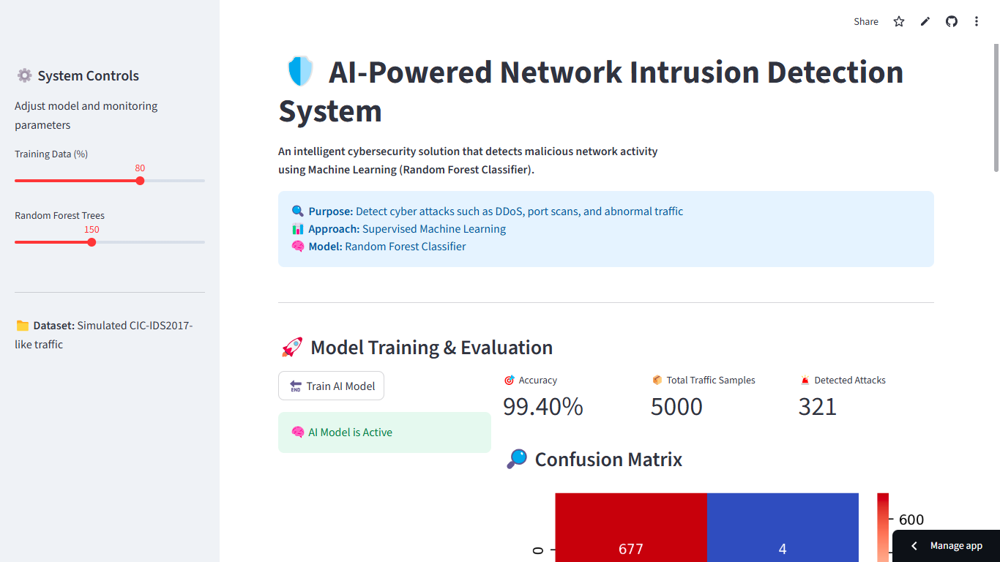
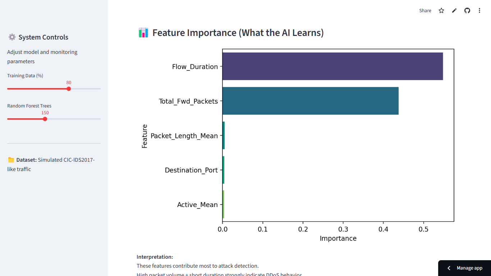
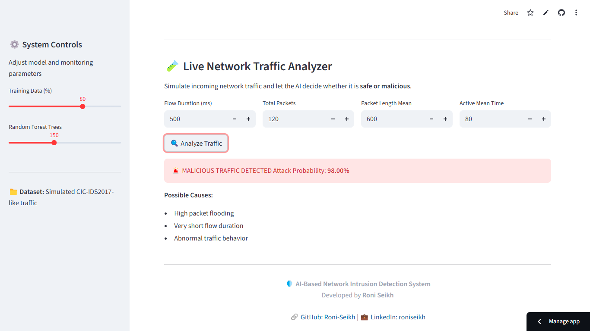

# 🛡️ AI-Based Network Intrusion Detection System (AI-NIDS)

An **AI-powered cybersecurity application** that detects malicious network traffic using **Machine Learning (Random Forest)** and provides a **real-time interactive dashboard** built with **Streamlit**.

🔗 **Live Application:**
👉 [https://ai-nids-dashboard.streamlit.app/](https://ai-nids-dashboard.streamlit.app/)

---

## 📌 Project Overview

With the rapid growth of cyber threats such as **DDoS attacks, port scans, and abnormal traffic flooding**, traditional rule-based intrusion detection systems often fail to detect new and evolving attacks.

This project demonstrates how **Artificial Intelligence and Machine Learning** can be applied to network security by automatically learning traffic patterns and identifying potential intrusions.

### 🔍 Key Capabilities

* Detects **Benign vs Malicious** network traffic
* Uses **Random Forest Classifier**
* Provides **attack probability scoring**
* Interactive **SOC-style dashboard**
* Supports **simulated and real-world datasets (CIC-IDS2017)**
* Deployed on **Streamlit Community Cloud**

---

## 🎯 Objectives

* Apply Machine Learning to real-world **cybersecurity problems**
* Detect network intrusions with high accuracy
* Visualize attack patterns and model behavior
* Build a deployable, user-friendly security dashboard
* Gain hands-on experience with **AI + Cybersecurity + Cloud Deployment**

---

## 🧠 Technology Stack

| Category             | Tools                            |
| -------------------- | -------------------------------- |
| Programming Language | Python 3.8+                      |
| Machine Learning     | Scikit-learn (Random Forest)     |
| Data Processing      | Pandas, NumPy                    |
| Visualization        | Matplotlib, Seaborn              |
| Web Framework        | Streamlit                        |
| Deployment           | Streamlit Community Cloud        |
| Dataset              | Simulated CIC-IDS2017-style data |

---

## 🏗️ System Architecture

1. **Data Source**

   * Simulated network traffic (default)
   * Optional real-world CIC-IDS2017 dataset

2. **Preprocessing**

   * Feature selection
   * Train-test split

3. **Model Training**

   * Random Forest Classifier
   * Configurable number of trees

4. **Evaluation**

   * Accuracy
   * Confusion Matrix
   * Feature Importance

5. **Live Traffic Simulation**

   * User inputs packet parameters
   * AI predicts attack probability

---

## 📊 Features Implemented

* ✔️ Model training from dashboard
* ✔️ Accuracy & confusion matrix visualization
* ✔️ Feature importance analysis
* ✔️ Live traffic analyzer
* ✔️ Attack probability estimation
* ✔️ Professional UI with dark cybersecurity theme

---

## 🖼️ Screenshots

> Screenshots are stored inside the `screenshots/` directory.

### 🔹 Dashboard Overview



### 🔹 Model Training & Metrics


### 🔹 Feature Importance Analysis



### 🔹 Live Traffic Detection



---

## 🚀 How to Run Locally

### 1️⃣ Clone the Repository

```bash
git clone https://github.com/Roni-Seikh/ai-nids-dashboard.git
cd ai-nids-dashboard
```

### 2️⃣ Install Dependencies

```bash
pip install -r requirements.txt
```

### 3️⃣ Run the Application

```bash
streamlit run nids_main.py
```

### 4️⃣ Open in Browser

```
http://localhost:8501
```

---

## ☁️ Deployment

The application is deployed using **Streamlit Community Cloud** and connected directly to this GitHub repository.

🔗 **Live URL:**
[https://ai-nids-dashboard.streamlit.app/](https://ai-nids-dashboard.streamlit.app/)

---

## 🎓 Internship Details

This project was developed as part of an **AICTE-approved internship** conducted by **Edunet Foundation**, in collaboration with **VOIS and Vodafone Idea Foundation**, under the **VOIS for Tech Program**.

### 📄 Internship Information

* **Intern Name:** Roni Seikh
* **Organization:** Edunet Foundation
* **Program:** Cybersecurity with Generative AI
* **Duration:** 4 Weeks
* **Start Date:** 9th December 2025
* **End Date:** 6th January 2026

### 🎖️ Outcomes

* Hands-on cybersecurity project development
* Exposure to real-world attack detection techniques
* Mentorship from industry experts
* Certification from **AICTE & Edunet Foundation**

---

## 👨‍💻 Author

**Roni Seikh**
🎓 Brainware University

* 🔗 GitHub: [https://github.com/Roni-Seikh](https://github.com/Roni-Seikh)
* 💼 LinkedIn: [https://www.linkedin.com/in/roniseikh](https://www.linkedin.com/in/roniseikh)

---

## 🏁 Conclusion

This project demonstrates how **AI and Machine Learning** can significantly enhance **network security** by detecting intrusions automatically and intelligently. It serves as a strong academic project, a practical cybersecurity prototype, and a professional portfolio artifact.